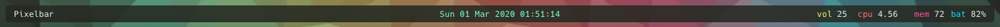
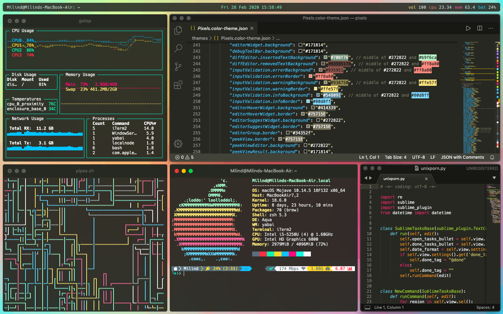

# Pixelbar


 Toolbar for Ubersicht. Slightly modified version of [zenbar](https://github.com/zhaorz/zenbar/blob/master/README.md) by zhaorz


 Sample usage of Pixelbar

## Installation

1. Install [Übersicht](http://tracesof.net/uebersicht/)

2. Run the following command to clone the repo:
```bash
git clone https://github.com/Mi1ind/Pixelbar $HOME/Library/Application\ Support/Übersicht/widgets/Pixelbar
```

Note: In order to show current window in the corner left, you need to have [yabai](https://github.com/koekeishiya/yabai) & [jq](https://github.com/stedolan/jq) installed.

